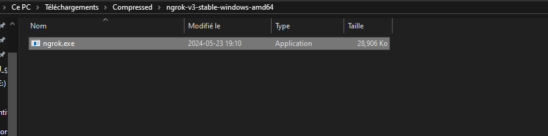

# Frontend

This project was generated with [Angular CLI](https://github.com/angular/angular-cli) version 16.0.2.

## Development server

Run `ng serve` for a dev server. Navigate to `http://localhost:4200/`. The application will automatically reload if you change any of the source files.

## Code scaffolding

Run `ng generate component component-name` to generate a new component. You can also use `ng generate directive|pipe|service|class|guard|interface|enum|module`.

## Build

Run `ng build` to build the project. The build artifacts will be stored in the `dist/` directory.

## Running unit tests

Run `ng test` to execute the unit tests via [Karma](https://karma-runner.github.io).

## Running end-to-end tests

Run `ng e2e` to execute the end-to-end tests via a platform of your choice. To use this command, you need to first add a package that implements end-to-end testing capabilities.


# lancement de build jenkins automatiquement 


## install le ngrok 


## lancer le terminal de ngrok 


## webhook du github 


## dans pipeline cocher GitHub hook trigger for GITScm polling


## check pour le dernier push 


# deploy stage 

## kubernets commandes :
```
kubectl apply -f deployment.yaml
kubectl apply -f service.yaml
kubectl apply -f ingress.yaml
kubectl get svc frontend-service

```


## mise a jour  demi final :


## test phase  e2e doc : 

```
node .\testaccpage.js
```


# Video Tutoriel
## Vidéo Test 

[Regardez la vidéo](./testPRV.js%20-%20frontend%20-%20Visual%20Studio%20Code%202024-05-29%2000-43-46.mp4)
